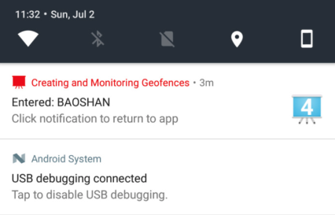

# Android Location Note

## Note 1

使用 Google Play Service 提供的 Fused Location API，替代 Android 系统提供的原生 API。

学习文档：

1. [Building Apps with Location & Maps](https://developer.android.com/training/building-location.html)
1. [Reduce friction with the new Location APIs](https://android-developers.googleblog.com/2017/06/reduce-friction-with-new-location-apis.html)

### Getting the Last Known Location

#### Setup Google Play Services

首先要配置 Google Play Services，要先通过 SDK Manager 把 Google Repository 下载到要地，然后将其依赖添加到工程 module 级的 build.gradle 中。

    dependencies {
        compile 'com.google.android.gms:play-services-location:11.0.1'
    }

但是，要使用 Google Play Services，还有一个前提，手机必须是 4.0 以上 (这个能满足)，手机上必须安装了最新版的 Google Play Store App (这个就 shit 了，中国的手机基本不满足...)，因为 Google Play Services 提供的 API 实际上都是由 Google Play Store App 来完成实际工作的 (Why? 为什么要这么设计，shit again!)。

在使用这个 API 之前，都要先判断手机上的 Google Play Store App 有没有安装，能不能用，需不需要升级 (奇芭!)。有两种方法：

1. 使用 GoogleApiClient 类，注册 OnConnectionFailedListener，在 onConnectionFailed() 回调中处理 Google Play Services 无法使用的问题，包括三种结果：`SERVICE_MISSIONG`，`SERVICE_VERSION_UPDATE_REQUIRED`，`SERVICE_DISABLED`。
1. 使用 GoogleApiAvailability.getInstance().isGooglePlayServiceAvaiable() 方法判断，如果结果为 SUCCESS 则 Google Play Services API 可用，否则，可能得到上面所说的三种结果，用 getErrorDialog(errResult) 方法获取一个 Dialog 并显示给用户，提示用户安装或升级 Google Play Store App。

更详细的说明：[Accessing Google APIs](https://developers.google.com/android/guides/api-client)

#### 指定 Location Permission

Android 提供 2 种 location permission：`ACCESS_FINE_LOCATION` 和 `ACCESS_COARSE_LOCATION`，此例中我们只请求 `ACCESS_COARSE_LOCATION` 权限，这个权限只能得到精度比较低的 location。

从 Android 6.0 开始，部分权限还需要在程序中动态请求。

#### Create Location Services Client

在 Google Play Service 11.0.0 之前，正如上面所言，使用这些 API 之前，先要创建 GoogleApiClient，处理连接问题。但从 Google Play Service 11.0.0 开始，使用 Location API 时，在 [Reduce friction with the new Location APIs](https://android-developers.googleblog.com/2017/06/reduce-friction-with-new-location-apis.html) 这篇文章里说，不再需要 GoogleApiClient 类。直接使用 FusedLocationClient 就行。

示例代码：

    private FusedLocationProviderClient mFusedLocationClient;
    // ..
    @Override
    protected void onCreate(Bundle savedInstanceState) {
        // ...
        mFusedLocationClient = LocationServices.getFusedLocationProviderClient(this);
    }

#### Get the Last Know Location

使用 getLocation().addOnSuccessListener() 方法。

    mFusedLocationClient.getLastLocation()
            .addOnSuccessListener(this, new OnSuccessListener<Location>() {
                @Override
                public void onSuccess(Location location) {
                    // Got last known location. In some rare situations this can be null.
                    if (location != null) {
                        // ...
                    }
                }
            });

运行结果：

- 在我的已安装最新版 Google Play 的 Meizu MX4 Pro (Android 5.1.1) 上，得到了 null 值的 location，且没有弹出需要获取位置权限的通知 (对国产手机的兼容性极差)
- 在一台安装了老版本 Google Play 的 Samsung 手机上运行时，自动弹出了 Dialog 说道：您必须更新 Google Play 服务，然后才能运行 GoogleLocationSample。
- 在安装了最新版的 Google Play 的 OnePlus 3T (android 7.1) 上运行，一切正常。

### Changing Location Settings & Receiving Location Updates

**初步测试发现，此功能需要 VPN 支持**

监听 location 的流程：

1. 动态检查并请求 location 权限

1. 检查当前手机的设置是否能够符合我们想要请求的 location 的精度要求。比如通过 蜂窝/WIFI/GPS 都可以取到 location，但前二者的精度较低，GPS 的精度较高。如果我们想请求高精度的 location，却发现只有 wifi 和蜂窝的开关打开了，GPS 的开关没有打关，这样的设置就不符合我们的要求，此时，我们就需要请求用户打开 GPS 开关。

   这里面涉及到三个类，LocationRequest，表示我们对 location 的要求，主要是精度要求，有四种值，后面再讲。LocationSettingRequest，这个请求用来查询当前手机设置与我们想要的 LocationRequest 是否匹配，所以，这个 LocationSettingRequest 自然是需要和 LocationRequest 关联的，因此 LocationSettingRequest 是这样生成的：

        mLocationRequest = new LocationRequest();
        mLocationRequest.setInterval(UPDATE_INTERVAL_IN_MILLISECONDS);
        mLocationRequest.setFastestInterval(FASTEST_UPDATE_INTERVAL_IN_MILLISECONDS);
        mLocationRequest.setPriority(LocationRequest.PRIORITY_HIGH_ACCURACY);

        mLocationSettingsRequest = new LocationSettingsRequest.Builder()
                .addLocationRequest(mLocationRequest)
                .build();

   然后，我们用 SettingClient 来实现设置的查询：

        SettingsClient client = LocationServices.getSettingsClient(this);
        Task<LocationSettingsResponse> task = client.checkLocationSettings(mLocationSettingsRequest);

   SettingsClient.checkLocationSettings() 返回值是一个 task，我们给 task 注册成功和失败的监听器，如果产生失败的回调，说明当前手机设置没有达到我们的 location 要求，需要更改手机设置，因此我们要弹出 dialog 提示用户去修改设置，打开更多开关。如果产生成功的回调，说明当前手机设置是 OK 的，不需要修改。

1. 在上一步 task 的成功回调中，用 FusedLocationProviderClient.requestLocationUpdates() 去请求并监听 location 的变化，其中第一个参数 LocationRequest 必须和上一步中查询设置所用到的 LocationRequest 保持一致。

        mFusedLocationClient = LocationServices.getFusedLocationProviderClient(this);
        mLocationCallback = new LocationCallback() {
            @Override
            public void onLocationResult(LocationResult locationResult) {
                super.onLocationResult(locationResult);
                mCurrentLocation = locationResult.getLastLocation();
                // ...
                // updateUI();
            }
        };

        task.addOnSuccessListener(this, new OnSuccessListener<LocationSettingsResponse>() {
                    @SuppressWarnings("MissingPermission")
                    @Override
                    public void onSuccess(LocationSettingsResponse locationSettingsResponse) {
                        mFusedLocationClient.requestLocationUpdates(mLocationRequest,
                                mLocationCallback, Looper.myLooper());
                        //...
                    }
                })
            .addOnFailureListener(...)

整个流程还是有点麻烦的，麻烦也还好啦，但最关键的是，测试后发现，这套 API 在我的国产手机 Meizu Android 5.0 上基本不 work (尽管已经安装了最新版的 Google Play)，也没有什么错误，但就是得不到结果...在 OnePlus 3T Android 7.0 上是正常的。

LocationRequest 的精度要求的四个级别：

- `PRIORITY_BALANCED_POWER_ACCURACY`: 大概是一个街区 100 米的精度，可能使用 WIFI 或 cell，coarse 的精度
- `PRIORITY_HIGH_ACCURACY`: 可能使用 GPS，一步的精度?
- `PRIORITY_LOW_POWER`: 10 千米的精度
- `PRIORITY_NO_POWER`: 不会主动获取 location，只会被动的接受别的 app 获取的 location

googlesamples 里还有两个例子：

- Location Updates using a PendingIntent: Get updates about a device's location using a PendingIntent. Sample shows implementation using an IntentService as well as a BroadcastReceiver. 在 FusedLocationProviderClient.requestLocationUpdates(locationRequest, pendingIntent) 方法中，没有使用 callback 来接收回调，而是用 pendingIntent 来接收新的 location。
- Location Updates using a Foreground Service: Get updates about a device's location using a bound and started foreground service. 在 Foreground Service 中监听 location。

### Displaying a Location Address

**初步测试发现，此功能需要 VPN 支持，holy shit! Geocoder 不是 android 框架的内容吗? 这也不能用，太夸张了吧**

将地址转换成 location 坐标，这个过程叫 geocoding，将 location 坐标转换成地址，这个过程叫 reverse geocoding，Android 框架中提供了原生 API Geocoder 来处理这个事情，使用 Geocoder.getFromLocation() 方法。

Geocode 是同步调用，而它对 location 进行转换又是一个耗时操作，所以要把它放到一个单独的线程里工作，可以选择 AsyncTask 或 IntentService，但前者和 Activity 的生命周期相关，如果 Activity 中途被重建了，AsyncTask 的结果就不会更新到新的 Activity 上，所以文档中选择了使用 IntentService 来在后台进行转换，通过 ResultReceiver 回传 address 结果。(注意，这里的 ResultReceiver 只是一个普通的 Parcelable，跟 BroadcastReceiver 没有关系)。

核心代码：

    try {
        addresses = geocoder.getFromLocation(
                location.getLatitude(),
                location.getLongitude(),
                // In this sample, get just a single address.
                1);
    } catch (IOException ioException) {
        // Catch network or other I/O problems.
        errorMessage = getString(R.string.service_not_available);
        Log.e(TAG, errorMessage, ioException);
    } catch (IllegalArgumentException illegalArgumentException) {
        // Catch invalid latitude or longitude values.
        errorMessage = getString(R.string.invalid_lat_long_used);
        Log.e(TAG, errorMessage + ". " +
                "Latitude = " + location.getLatitude() +
                ", Longitude = " +
                location.getLongitude(), illegalArgumentException);
    }

### Creating and Monitoring Geofences 

The latitude, longitude, and radius define a geofence, creating a circular area, or fence, around the location of interest.

You can have multiple active geofences, with a limit of 100 per device user. For each geofence, you can ask Location Services to send you entrance and exit events, or you can specify a duration within the geofence area to wait, or dwell, before triggering an event. You can limit the duration of any geofence by specifying an expiration duration in milliseconds. After the geofence expires, Location Services automatically removes it.

我的理解：Geofence 就是你划定的一块范围，然后你可以监听当前 location 的变化，如果当前 location 进入或离开，或停留在刚才划定的那块范围内，就会收到相应的事件通知。

运行本小节的[示例工程](https://github.com/googlesamples/android-play-location/tree/master/Geofencing)，因为程序中默认划定的区域是硅谷，所以你除非在硅谷，否则测试时永远收不到事件通知，修改代码，加上当前你所在位置的区域，就能收到通知了。

    // Constants.java
    static {
        // San Francisco International Airport.
        BAY_AREA_LANDMARKS.put("SFO", new LatLng(37.621313, -122.378955));

        // Googleplex.
        BAY_AREA_LANDMARKS.put("GOOGLE", new LatLng(37.422611,-122.0840577));

        // MyLocation
        BAY_AREA_LANDMARKS.put("BAOSHAN", new LatLng(31.323331,121.392625));
    }

收到的通知：

#### Set up for Geofence Monitoring

1. 在 AndroidManifest.xml 中声明 `android.permission.ACCESS_FINE_LOCATION` 权限。

1. 在 AndroidManifest.xml 中添加用于处理 Geofence 事件的 IntentService。

        <application
            android:allowBackup="true">
            ...
            <service android:name=".GeofenceTransitionsIntentService"/>
        <application/>

1. 创建 GeofencingClient 实例。

        private GeofencingClient mGeofencingClient;
        // ...
        mGeofencingClient = LocationServices.getGeofencingClient(this);

#### Create and Add Geofences

创建 Geofence，Geofence 就是一块区域范围，是圆形的，指定经纬度作为圆心，再指定一个半径作为范围，还可以指定监听这个 Geofence 的变化类型，是监听进入，还是离开，还是停留，或者是都监听。Geofence 可以由 Geofence.Builder 来生成。

可以创建多个 Geofence，把它们加入一个列表中，然后用这个列表去创建 GeofenceRequest，GeofenceRequest 可以用 GeofencingRequest.Builder 来生成。

之后再创建 PendingIntent 来处理 Geofence 的变化事件。

最后，把 GeofenceRequest 和 PendingIntent 加入到 GeofencingClient 中，开始监听 Geofence 事件。

##### Create geofence objects

    mGeofenceList.add(new Geofence.Builder()
        // Set the request ID of the geofence. This is a string to identify this
        // geofence.
        .setRequestId(entry.getKey())

        .setCircularRegion(
                entry.getValue().latitude,
                entry.getValue().longitude,
                Constants.GEOFENCE_RADIUS_IN_METERS
        )
        .setExpirationDuration(Constants.GEOFENCE_EXPIRATION_IN_MILLISECONDS)
        .setTransitionTypes(Geofence.GEOFENCE_TRANSITION_ENTER |
                Geofence.GEOFENCE_TRANSITION_EXIT)
        .build());

在这个例子中，Geofence 的经纬度是个常量，实际项目中，这个值会根据我们的当前位置来动态生成。

##### Specify geofences and initial triggers

    private GeofencingRequest getGeofencingRequest() {
        GeofencingRequest.Builder builder = new GeofencingRequest.Builder();
        builder.setInitialTrigger(GeofencingRequest.INITIAL_TRIGGER_ENTER);
        builder.addGeofences(mGeofenceList);
        return builder.build();
    }

`INITIAL_TRIGGER_ENTER` 表示，当监听开始时，如果当前位置已处于所划定的 Geofence 中时，会触发 Geofence 的 `GEOFENCE_TRANSITION_ENTER` 事件。

为是减少 spam 打扰及减少电池消耗，更推存使用 `INITIAL_TRIGGER_DWELL`，它表示，只有当你在某个 Geofence 中停留超过指定的时长后，才会触发事件。

另外，当 Geofence 的范围设置为不小于 100 米，也可以减少电池消耗，及减小 WIFI 的 location 精确度的影响。

##### Define an Intent for geofence transitions

    public class MainActivity extends AppCompatActivity {
        // ...
        private PendingIntent getGeofencePendingIntent() {
            // Reuse the PendingIntent if we already have it.
            if (mGeofencePendingIntent != null) {
                return mGeofencePendingIntent;
            }
            Intent intent = new Intent(this, GeofenceTransitionsIntentService.class);
            // We use FLAG_UPDATE_CURRENT so that we get the same pending intent back when
            // calling addGeofences() and removeGeofences().
            mGeofencePendingIntent = PendingIntent.getService(this, 0, intent, PendingIntent.
                    FLAG_UPDATE_CURRENT);
            return mGeofencePendingIntent;
    }

##### Add geofences

    mGeofencingClient.addGeofences(getGeofencingRequest(), getGeofencePendingIntent())
        .addOnSuccessListener(this, new OnSuccessListener<Void>() {
            @Override
            public void onSuccess(Void aVoid) {
                // Geofences added
                // ...
            }
        })
        .addOnFailureListener(this, new OnFailureListener() {
            @Override
            public void onFailure(@NonNull Exception e) {
                // Failed to add geofences
                // ...
            }
        });

#### Handle Geofence Transitions

When Location Services detects that the user has entered or exited a geofence, it sends out the Intent contained in the PendingIntent you included in the request to add geofences. This Intent is received by a service like GeofenceTransitionsIntentService, which obtains the geofencing event from the intent, determines the type of Geofence transition(s), and determines which of the defined geofences was triggered. It then sends a notification as the output.

当 Location Service 检测到当前用户进入或离开一个 Geofence 时，它会发出一个注册在 GeofencingClient 中的 PendingIntent，这个 Intent 将会交给指定的 IntentService 处理，这个 intent 中携带了触发 Geofence 的事件类型等数据。

    public class GeofenceTransitionsIntentService extends IntentService {
        // ...
        protected void onHandleIntent(Intent intent) {
            GeofencingEvent geofencingEvent = GeofencingEvent.fromIntent(intent);
            if (geofencingEvent.hasError()) {
                String errorMessage = GeofenceErrorMessages.getErrorString(this,
                        geofencingEvent.getErrorCode());
                Log.e(TAG, errorMessage);
                return;
            }

            // Get the transition type.
            int geofenceTransition = geofencingEvent.getGeofenceTransition();

            // Test that the reported transition was of interest.
            if (geofenceTransition == Geofence.GEOFENCE_TRANSITION_ENTER ||
                    geofenceTransition == Geofence.GEOFENCE_TRANSITION_EXIT) {

                // Get the geofences that were triggered. A single event can trigger
                // multiple geofences.
                List<Geofence> triggeringGeofences = geofencingEvent.getTriggeringGeofences();

                // Get the transition details as a String.
                String geofenceTransitionDetails = getGeofenceTransitionDetails(
                        this,
                        geofenceTransition,
                        triggeringGeofences
                );

                // Send notification and log the transition details.
                sendNotification(geofenceTransitionDetails);
                Log.i(TAG, geofenceTransitionDetails);
            } else {
                // Log the error.
                Log.e(TAG, getString(R.string.geofence_transition_invalid_type,
                        geofenceTransition));
            }
        }

#### Stop Geofence Monitoring

调用 GeofencingClient 实例的 removeGeofences() 方法。有两种实现，一种是参数是 PendingIntent，一种是参数是 List<String>，表示 Geofences 的 RequestId。

#### Use Best Practices for Geofencing

略，用到时再回来细看。总体而言，主要是选择最优的半径，Geofence 的半径不要太小，尽量选择 DWELL 的事件类型，替代 ENTER。

(貌似 Geofence 的功能主要是依赖 WIFI 来定位，而不是 GPS??，因为 WIFI 的精度已经能达到 100m，而 Geofence 推荐的最小半径就是 100m)。
